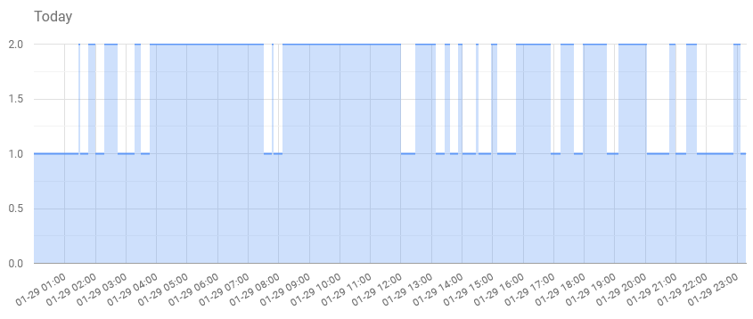

# Qnap HDD spin down monitor
> This script monitors the HDD spin ups and downs on a Qnap

## The Device
I own a Qnap TS-431P2, which -like a lot more people appareantly, has problems with keeping the HDDs spun down. I wanted to monitor the times it's spinning up because too much spin ups will wear the disks more than having them running all the time, so it might make more sense to keep them on. 

The power LED is the one you wan't to monitor, because it goes out whenever the disks spin down. Basically Qnap writes the state of the LEDs to a file called `/var/ledvalue`. It contains a 32-bit hexadecimal word as ASCII. For me the 4th hexadecimal was the state of the power LED. A `0` means the green LED is on, so disks are running, a `1` means the LED is off and disks are spun down. I think `2` means orange for an error, which is irrelevant here. 

## The Script (local)
I've tested this with QTS 4.5.1.1456. Basically this Python script runs as a daemon on another linux machine I had (could be a Raspberry Pi or similar). It opens a SFTP connection and keeps it open. This is necessary because if you restart the SFTP connection the Qnap disks spin up. The script reads the LED values every 30 seconds and uploads it to a webserver. The only thing to do is to enable SSH and SFTP in the QTS Control Panel. There's also a boilerplate `init.d` script to start and stop the daemon.

## Uploads (web)
On the server, the right LED value is filtered and put in a database. The front end is a basic Google Chart showing the values in the database for a givin day. 

Value | Meaning
----- | -------
1 | HDDs are running
2 | HDDs spun down
Other | An error occured reading the LED value

## Credits
Google Charts

## License
"Creative Commons Attribution 3.0" license: http://creativecommons.org/licenses/by/3.0/